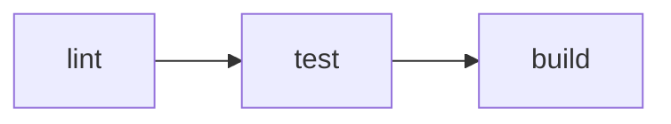

# Команда `vp run` {#run}

`vp run` запускает скрипты из `package.json` и задачи, определённые в `vite.config.ts`. Он работает аналогично `pnpm run`, но с встроенной поддержкой кэширования, порядка выполнения зависимостей и выполнения с учётом структуры рабочего пространства.

::: tip
`vpr` доступен как сокращённый вариант команды `vp run`. Все приведённые ниже примеры работают как с `vp run`, так и с `vpr`.
:::

## Обзор {#overview}

Используйте `vp run` с существующими скриптами из `package.json`:

```json [package.json]
{
  "scripts": {
    "build": "node compile-legacy-app.js",
    "test": "jest"
  }
}
```

`vp run build` выполняет соответствующий скрипт сборки:

```
$ node compile-legacy-app.js

building legacy app for production...

✓ built in 69s
```

Используйте `vp run` без имени задачи, чтобы открыть интерактивный запуск задач:

```
Select a task (↑/↓, Enter to run, Esc to clear):

  › build: node compile-legacy-app.js
    test: jest
```

## Кэширование {#caching}

Скрипты из `package.json` по умолчанию не кэшируются. Используйте `--cache`, чтобы включить кэширование:

```bash
vp run --cache build
```

```
$ node compile-legacy-app.js
✓ built in 69s
```

Если ничего не изменилось, при следующем запуске вывод будет воспроизведён из кэша:

```
$ node compile-legacy-app.js ✓ cache hit, replaying
✓ built in 69s

---
vp run: cache hit, 69s saved.
```

Если входные данные изменились, задача будет выполнена повторно:

```
$ node compile-legacy-app.js ✗ cache miss: 'legacy/index.js' modified, executing
```

## Определение задач {#task-definitions}

Vite Task автоматически отслеживает, какие файлы использует ваша команда. Вы можете определять задачи непосредственно в `vite.config.ts`, чтобы включить кэширование по умолчанию или управлять тем, какие файлы и переменные окружения влияют на поведение кэша.

```ts [vite.config.ts]
import { defineConfig } from 'vite-plus';

export default defineConfig({
  run: {
    tasks: {
      build: {
        command: 'vp build',
        dependsOn: ['lint'],
        env: ['NODE_ENV'],
      },
      deploy: {
        command: 'deploy-script --prod',
        cache: false,
        dependsOn: ['build', 'test'],
      },
    },
  },
});
```

Если вы хотите запустить существующий скрипт из `package.json` без изменений, используйте `vp run <script>`. Если вам нужны кэширование на уровне задач, зависимости или управление окружением и входными данными, определите задачу с явно указанной командой `command`. Имя задачи может быть определено либо в `vite.config.ts`, либо в `package.json`, но не в обоих местах одновременно.

::: info
Задачи, определённые в `vite.config.ts`, по умолчанию кэшируются. Скрипты из `package.json` — нет. Полный порядок разрешения см. в разделе [Когда включено кэширование?](/guide/cache#when-is-caching-enabled).
:::

Полное описание блока `run` см. в разделе [Конфигурация Run](/config/run).

## Зависимости задач {#task-dependencies}

Используйте [`dependsOn`](/config/run#dependson), чтобы запускать задачи в правильном порядке. При выполнении `vp run deploy` с конфигурацией выше сначала будут выполнены `build` и `test`. Зависимости также могут ссылаться на задачи из других пакетов того же проекта с помощью нотации `package#task`:

```ts [vite.config.ts]
dependsOn: ['@my/core#build', '@my/utils#lint'];
```

## Выполнение в рабочем пространстве {#running-in-a-workspace}

Если не указаны флаги выбора пакетов, `vp run` выполняет задачу в пакете, соответствующем вашему текущему рабочему каталогу:

```bash
cd packages/app
vp run build
```

Вы также можете явно указать пакет для выполнения из любого места:

```bash
vp run @my/app#build
```

Порядок выполнения пакетов в рабочем пространстве определяется обычным графом зависимостей монорепозитория, объявленным в `package.json` каждого пакета. Другими словами, когда Vite+ говорит о зависимостях пакетов, имеются в виду стандартные связи `dependencies` между пакетами рабочего пространства, а не отдельный граф, специфичный для системы запуска задач.

### Рекурсивный запуск (`-r`) {#recursive-r}

Запустите задачу во всех пакетах рабочего пространства в порядке зависимостей:

```bash
vp run -r build
```

Этот порядок зависимостей определяется пакетами рабочего пространства, на которые ссылаются зависимости в `package.json`.

### Транзитивный запуск (`-t`) {#transitive-t}

Запустите задачу в одном пакете и во всех его зависимостях:

```bash
vp run -t @my/app#build
```

Если `@my/app` зависит от `@my/utils`, а тот, в свою очередь, зависит от `@my/core`, эта команда выполнит задачу во всех трёх пакетах по порядку. Vite+ определяет эту цепочку на основе обычных зависимостей пакетов рабочего пространства, объявленных в `package.json`.

### Фильтрация (`--filter`) {#filter-filter}

Выбирайте пакеты по имени, каталогу или глоб-шаблону. Синтаксис соответствует `--filter` в pnpm:

```bash
# По имени
vp run --filter @my/app build

# По глоб-шаблону
vp run --filter "@my/*" build

# По каталогу
vp run --filter ./packages/app build

# Включить зависимости
vp run --filter "@my/app..." build

# Включить зависимые пакеты
vp run --filter "...@my/core" build

# Исключить пакеты
vp run --filter "@my/*" --filter "!@my/utils" build
```

Несколько флагов `--filter` объединяются по принципу объединения множеств. Фильтры исключения применяются после всех фильтров включения.

Если `--filter` не соответствует ни одному пакету, Vite+ выводит предупреждение и завершает работу успешно. Передайте `--fail-if-no-match`, чтобы прервать выполнение, если хотя бы один фильтр не соответствует ни одному пакету.

### Корень рабочего пространства (`-w`) {#workspace-root-w}

Явно выполните задачу в корневом пакете рабочего пространства:

```bash
vp run -w build
```

## Составные команды {#compound-commands}

Команды, объединённые через `&&`, разделяются на независимые подзадачи. Каждая подзадача кэшируется отдельно, если [кэширование включено](/guide/cache#when-is-caching-enabled). Это работает как для задач, определённых в `vite.config.ts`, так и для скриптов из `package.json`:

```json [package.json]
{
  "scripts": {
    "check": "vp lint && vp build"
  }
}
```

Теперь выполните `vp run --cache check`:

```
$ vp lint
Found 0 warnings and 0 errors.

$ vp build
✓ built in 28ms

---
vp run: 0/2 cache hit (0%).
```

У каждой подзадачи есть собственная запись в кэше. Если изменились только файлы `.ts`, но проверка линтером по-прежнему проходит успешно, при следующем запуске `vp run --cache check` будет повторно выполнена только команда `vp build`:

```
$ vp lint ✓ cache hit, replaying
$ vp build ✗ cache miss: 'src/index.ts' modified, executing
✓ built in 30ms

---
vp run: 1/2 cache hit (50%), 120ms saved.
```

### Вложенная команда `vp run` {#nested-vp-run}

Если команда содержит `vp run`, Vite Task разворачивает его в отдельные задачи вместо запуска вложенного процесса. Каждая подзадача кэшируется независимо, а вывод остаётся плоским:

```json [package.json]
{
  "scripts": {
    "ci": "vp run lint && vp run test && vp run build"
  }
}
```

При выполнении `vp run ci` команда разворачивается в три задачи:



Флаги также работают внутри вложенных скриптов. Например, `vp run -r build` внутри скрипта разворачивается в отдельные задачи сборки для каждого пакета.

::: info
Распространённый шаблон в монорепозиториях — корневой скрипт, который рекурсивно запускает задачу:

```json [package.json (root) ~vscode-icons:file-type-node~]
{
  "scripts": {
    "build": "vp run -r build"
  }
}
```

Это создаёт потенциальную рекурсию: корневой `build` → `vp run -r build` → включает корневой `build` → ...

Vite Task автоматически обнаруживает такую ситуацию и исключает самоссылку, поэтому сборка остальных пакетов выполняется как обычно.
:::

## Сводка выполнения {#execution-summary}

Используйте `-v`, чтобы показать подробную сводку выполнения:

```bash
vp run -r -v build
```

```
━━━━━━━━━━━━━━━━━━━━━━━━━━━━━━━━━━━━━━━━━━━━━━━
    Vite+ Task Runner • Execution Summary
━━━━━━━━━━━━━━━━━━━━━━━━━━━━━━━━━━━━━━━━━━━━━━━

Statistics:   3 tasks • 3 cache hits • 0 cache misses
Performance:  100% cache hit rate, 468ms saved in total

Task Details:
────────────────────────────────────────────────
  [1] @my/core#build: ~/packages/core$ vp build ✓
      → Cache hit - output replayed - 200ms saved
  ·······················································
  [2] @my/utils#build: ~/packages/utils$ vp build ✓
      → Cache hit - output replayed - 150ms saved
  ·······················································
  [3] @my/app#build: ~/packages/app$ vp build ✓
      → Cache hit - output replayed - 118ms saved
━━━━━━━━━━━━━━━━━━━━━━━━━━━━━━━━━━━━━━━━━━━━━━━
```

Используйте `--last-details`, чтобы показать сводку последнего запуска без повторного выполнения задач:

```bash
vp run --last-details
```

## Параллелизм {#concurrency}

По умолчанию одновременно выполняются не более 4 задач. Используйте `--concurrency-limit`, чтобы изменить это значение:

```bash
# Выполнять до 8 задач одновременно
vp run -r --concurrency-limit 8 build

# Выполнять задачи по одной
vp run -r --concurrency-limit 1 build
```

Ограничение также можно задать через переменную окружения `VP_RUN_CONCURRENCY_LIMIT`. Флаг `--concurrency-limit` имеет приоритет над переменной окружения.

### Параллельный режим {#parallel-mode}

Используйте `--parallel`, чтобы игнорировать зависимости между задачами и запускать все задачи одновременно без ограничений по параллелизму:

```bash
vp run -r --parallel dev
```

Это полезно, когда задачи независимы друг от друга и требуется максимальная пропускная способность. Можно комбинировать `--parallel` с `--concurrency-limit`, чтобы запускать задачи без учёта зависимостей, но при этом ограничивать количество одновременно выполняемых задач:

```bash
vp run -r --parallel --concurrency-limit 4 dev
```

## Дополнительные аргументы {#additional-arguments}

Аргументы после имени задачи передаются непосредственно команде задачи:

```bash
vp run test --reporter verbose
```
